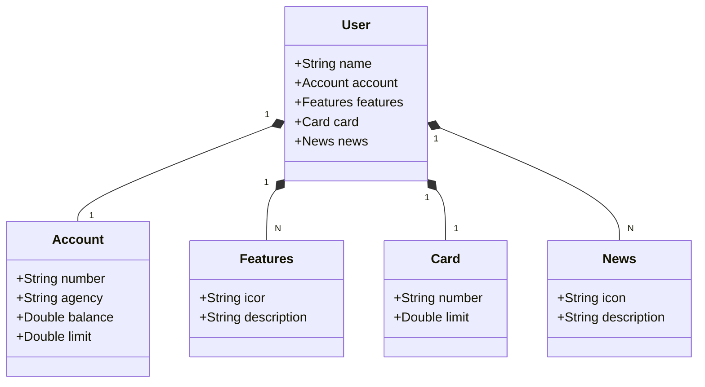

# Santander Dev Week 2025
Java RESTful API criada para o bootcamp da Avanade na plataforma DIO!

## Diagrama de classes 

```mermaid

classDiagram
    class User {
        +String name
        +Account account
        +Features features
        +Card card
        +News news
    }
    
    class Account {
        +String number
        +String agency
        +Double balance
        +Double limit
    }
    
    class Features {
        +String icor
        +String description
    }
    
    class Card {
        +String number
        +Double limit
    }
    
    class News {
        +String icon
        +String description
    }
    
    User "1" *-- "1" Account
    User "1" *-- "N" Features
    User "1" *-- "1" Card
    User "1" *-- "N" News

```
